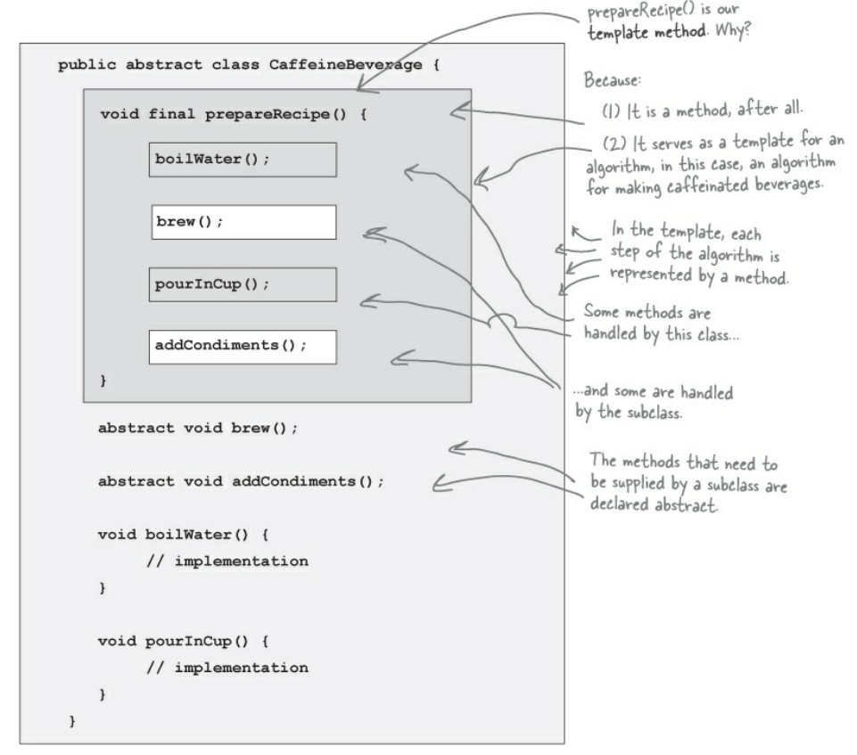
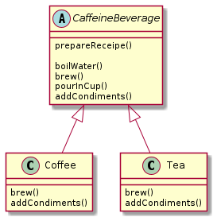

## The Template Method
* Defines the steps of an algorithm and allows subclasses to provide the implementation for one or more steps.
* It is a method
* Serves a template for an algorithm
* Each step of the algorithm is represented by a method
* Some methods are handled by this class and some are handled by the subclass
* The methods that need to be supplied by a subclass are declared abstract

#### Template Method Example

#### CaffeineBeverage Example

