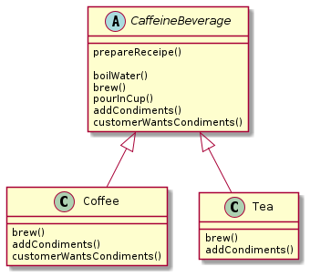

## The Template Method With Hook
* Defines the steps of an algorithm and allows subclasses to provide the implementation for one or more steps.
* It is a method
* Serves a template for an algorithm
* Each step of the algorithm is represented by a method
* Some methods are handled by this class and some are handled by the subclass
* The methods that need to be supplied by a subclass are declared abstract

##### Hook
* A hook is a method that is declared in the abstract class, but only given an empty or default implementation. 
* This gives subclasses the ability to “hook into” the algorithm at various points, if they wish; 
* A subclass is also free to ignore the hook.

#### CaffeineBeverageWithHook Example

